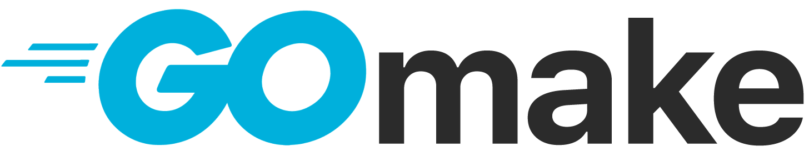

**gomake** is a powerful CLI tool for generating Go project structures with various architectural patterns. It helps developers quickly bootstrap Go applications with clean, well-organized code following industry best practices.

- **Multiple Architecture Patterns**: Support for Hexagonal, Clean, MVC, and Basic project structures
- **Interactive Project Setup**: Step-by-step wizard for easy project configuration
- **Docker Integration**: Automatic generation of Dockerfile and docker-compose.yml
- **Development Tools**: Built-in Makefile with common development tasks
- **Git Integration**: Initialize repository with proper .gitignore configuration
- **License Support**: Multiple license options (MIT, Apache, BSD, GPL)
- **Template System**: Flexible template-based file generation
- **Zero Dependencies**: Single binary with no external requirements

## Architecture Patterns

### 1. Hexagonal Architecture (Ports & Adapters)

Clean separation between business logic and external dependencies through ports and adapters pattern.

```bash
gomake project myapp --arch hexagonal
```

**Structure:**
```
myapp/
├── cmd/myapp/main.go
├── internal/
│   ├── core/
│   │   ├── domain/          # Business entities
│   │   ├── ports/           # Interfaces (ports)
│   │   └── services/        # Business logic
│   └── adapters/
│       ├── handlers/        # HTTP handlers
│       └── repositories/    # Data access
├── pkg/                     # Public packages
└── configs/                 # Configuration
```

**Benefits:**
- High testability
- Technology independence
- Clear separation of concerns
- Easy to maintain and extend

### 2. Clean Architecture

Enforces dependency inversion with clear layers: entities, use cases, interfaces, and infrastructure.

```bash
gomake project myapp --arch clean
```

**Structure:**
```
myapp/
├── cmd/myapp/main.go
├── internal/
│   ├── entities/            # Business entities
│   ├── usecases/            # Business logic
│   ├── interfaces/
│   │   ├── handlers/        # HTTP handlers
│   │   └── repositories/    # Repository interfaces
│   └── infrastructure/      # External dependencies
├── pkg/                     # Public packages
└── configs/                 # Configuration
```

**Benefits:**
- Independent of frameworks
- Testable business logic
- Independent of UI and database
- Clear dependency rule

### 3. MVC Architecture

Traditional Model-View-Controller pattern with clear separation of concerns.

```bash
gomake project myapp --arch mvc
```

**Structure:**
```
myapp/
├── cmd/myapp/main.go
├── internal/
│   ├── models/              # Data models
│   ├── views/               # Views/templates
│   └── controllers/         # Controllers
├── pkg/                     # Public packages
└── configs/                 # Configuration
```

**Benefits:**
- Simple and familiar structure
- Clear separation of concerns
- Easy to understand and implement
- Good for traditional applications

### 4. Basic Structure

Simple, lightweight structure perfect for small to medium projects and prototypes.

```bash
gomake project myapp --arch basic
```

**Structure:**
```
myapp/
├── cmd/myapp/main.go
├── internal/                # Private application code
├── pkg/                     # Public packages
├── api/                     # API documentation
├── configs/                 # Configuration
└── docs/                    # Documentation
```

**Benefits:**
- Simple and lightweight
- Quick to get started
- Flexible structure
- Good for prototypes and small services

## Installation

### Quick Install (Recommended)

```bash
curl -sSL https://raw.githubusercontent.com/gomake/gomake/main/scripts/install.sh | bash
```

### Manual Installation

#### From Source

```bash
# Clone the repository
git clone https://github.com/gomake/gomake.git
cd gomake

# Build and install
make build
sudo cp bin/gomake /usr/local/bin/

# Or install directly with Go
go install github.com/gomake/gomake/cmd/gomake@latest
```

### Verify Installation

```bash
gomake --help
gomake version
```

## Quick Start

### Basic Usage

```bash
# Create a simple project
gomake project myapp

# Create with specific architecture
gomake project myapp --arch hexagonal

# Interactive mode
gomake project myapp --interactive

# Full-featured project
gomake project myapp --arch clean --with-docker --with-git --license MIT --yes
```

### Example: Microservice with Hexagonal Architecture

```bash
# Generate the project
gomake project user-service --arch hexagonal --with-docker --with-git --yes

# Navigate and run
cd user-service
go mod tidy
make run

# Test the API
curl http://localhost:8080/health
```

## 🎛️ Command Reference

### Main Command

```bash
gomake project <name> [flags]
```

### Flags

- `-a, --arch string`: Architecture type (hexagonal, clean, mvc, basic)
- `-y, --yes`: Skip confirmation prompts
- `-d, --dir string`: Target directory
- `--with-docker`: Add Docker support
- `--with-git`: Initialize git repository
- `-i, --interactive`: Interactive setup wizard
- `-l, --license string`: License type (MIT, Apache, BSD, GPL)
- `-v, --verbose`: Verbose output

## License

This project is licensed under the MIT License - see the [LICENSE](LICENSE) file for details.

